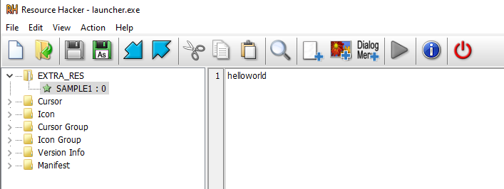

# WinExeResourceEditor
**WinExeResourceEditor** is a PowerShell script that allows engineers to update resources in an existing Windows executable (EXE) without recompiling the source code. It relies solely on native Windows APIs, eliminating the need for extra dependencies. The relevant Windows APIs used in this script include:

- BeginUpdateResourceW
- UpdateResourceW
- EndUpdateResourceW
- GetLastError

# Supported Features
The script currently supports two essential features:

1. **Adding Resources:** You can add new resources to an existing Windows executable.

2. **Updating Existing Resources:** You can update the content of existing resources in the executable.

Please note that listing and deleting existing resources are not supported by the script at this time. Engineers who need to perform such actions can use external tools like Resource Hacker to view and delete existing resources.

# Getting Started
Before using the PowerShell script, make sure to gather the following information:

- **Target EXE:** Provide the path to your target Windows executable. Keep in mind that this script does not automatically create backups of your EXE, so it's advisable to create one yourself before running the script.

- **Resource Type:** Specify the type of your resource. This can be an existing resource type or a new one. You can find more information about resource types on MSDN.

- **Resource Item:** Identify the item name of your resource. This can be an existing item or a new one.

- **Resource File:** This is the content of the resource you want to add or update. The script reads the content of the resource file as binary data and adds it to the Windows executable. As it handles the file in binary form, it supports all file types.

- **Language (optional):** You have the option to specify the language of the resource.

**Command Format**
```
exe_resource_editor.ps1 {target_exe} {resource_type} {resource_item} {resource_file} {language (optional)}
```

**Sample command**
```
exe_resource_editor.ps1 sample.exe EXTRA_RES SAMPLE1 SampleRes1.txt
```

**Sample Result**

[](https://github.com/WeiyunD/WinExeResourceEditor/blob/main/docs/sample.png)

> [!WARNING]  
> Don't forget to backup your executable before running the script!

Enjoy using **WinExeResourceEditor** for managing resources in your Windows executables!
